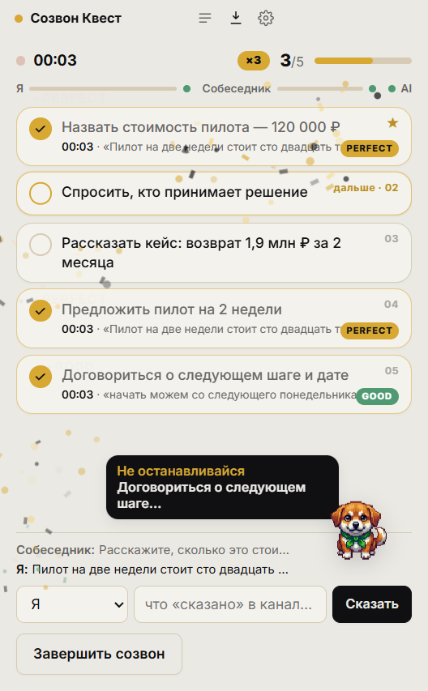
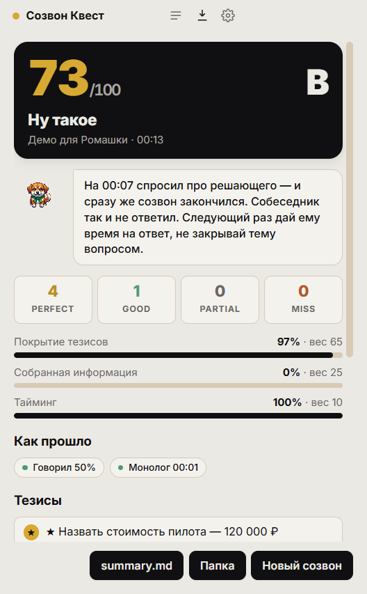

# Созвон Квест

Не даёт забыть, что важно обсудить на созвоне. Перед звонком записываешь, что нужно спросить, сказать или о чём договориться. Во время разговора пункты отмечаются сами, как только ты их озвучил, и перед глазами всегда то, что ещё осталось. В конце балл из 100 и разбор: что узнал от собеседника, что упустил и в какой момент это было уместно поднять.

Созвон с клиентом, собеседование, встреча с подрядчиком, разговор с инвестором: подходит любой звонок, где есть список того, что нельзя пропустить. Работает поверх Телемоста, Zoom, Meet и Teams. Открытый инструмент для Windows.

<p align="center">
  
  
</p>

## Как пользоваться

1. Скачай `SozvonQuest-x.y.z-portable.exe` из [Releases](https://github.com/glxaoc/sozvon-quest/releases) (или с зеркала на Яндекс.Диске, ссылка в описании релиза) и запусти. Установка не нужна. Windows при первом запуске покажет предупреждение SmartScreen «неизвестный издатель»: «Подробнее» → «Выполнить в любом случае». Подписи кода нет, это личный проект.
2. Мастер первого запуска попросит один ключ — от [AiTunnel](https://aitunnel.ru). Это российский агрегатор нейросетей: оплата в рублях, без VPN. Через него идёт и распознавание речи (Deepgram Nova-3, выбран по замеру на реальном созвоне), и ИИ-сверка, и разбор. Час созвона обходится примерно в 120 ₽. Ключ проверяется живым запросом и хранится только на твоём компьютере.
   По желанию в настройках можно добавить ключ [Nexara](https://nexara.ru): распознавание на секунду быстрее и точнее с цифрами, 0,36 ₽ за минуту речи.
3. Напиши тезисы, по одному на строку. Звёздочка в начале строки делает тезис критичным: вес двойной, а его пропуск режет ранг. Нажми «Начать созвон» и надень гарнитуру.

Что происходит дальше:

- **Закрытие тезиса.** Когда ты озвучил пункт, карточка вспыхивает, летят частицы, появляется оценка PERFECT (сказано прямо) или GOOD (своими словами). Закрытия подряд дают серию ×2, ×3. Если ассистент не уверен, карточка помечается «PARTIAL?», и её можно закрыть кликом.
- **Степаныч в углу.** Корги-ассистент дышит в покое, смотрит на того, кто говорит, прыгает при закрытии и дремлет, если все молчат. Тихо подсказывает, если ты говоришь дольше минуты подряд или пять минут ничего не закрывал.
- **Финал.** Балл из 100 докручивается с нуля, штампом влетает ранг: от «Волк созвонов» до «Клиент вёл, ты кивал». Ниже реплика Степаныча про этот созвон, раскладка по тезисам, что стоило спросить и в какой момент, что узнал от собеседника, доля речи и длиннейший монолог.
- **История.** Все созвоны лежат в Документы → SozvonQuest: `summary.md` для людей, `session.json` для машин. Лучший результат виден на стартовом экране.

## Как считается балл

| Блок | Вес | Что внутри |
|---|---|---|
| Покрытие тезисов | 65 | Perfect 1,0 · Good 0,8 · Partial 0,4 · Miss 0. Критичный тезис весит вдвое, его пропуск ставит потолок ранга A |
| Собранная информация | 25 | Для тезисов «узнать / спросить»: ответил ли собеседник по существу, уклончиво или не ответил |
| Тайминг | 10 | Доля тезисов, закрытых до последних 20 % созвона |

Доля речи, длиннейший монолог, слова-паразиты и частота смены говорящих показываются справочно, в балл не входят. Ориентиры взяты из исследований Gong на 326 тысячах звонков: лучшие продавцы говорят 43–46 % времени, монолог короче 76 секунд.

## Как устроено

```
renderer (Electron)                      main (Node)
┌───────────────────────┐   PCM16 16k   ┌────────────────────────────────────────────────┐
│ getUserMedia (микро)  ├──────────────►│ STT «me»  ──┐                                  │
│ getDisplayMedia       │   по IPC      │             ├─► transcript ─► ИИ-сверка ─► UI   │
│  audio:'loopback'     ├──────────────►│ STT «them» ─┘        │                         │
│ AudioWorklet → int16  │               │            финал: разбор + балл → summary.md   │
└───────────────────────┘               └────────────────────────────────────────────────┘
```

- **Два аудиоканала.** Микрофон через `getUserMedia`, системный звук через штатный Electron-механизм `audio: 'loopback'` (WASAPI). Нативных модулей нет. Поэтому и работает с любым приложением для созвонов.
- **Распознавание.** Энергетический VAD режет речь на фразы по паузам, каждая уходит в батч-эндпоинт AiTunnel (по умолчанию `nova-3`) или Nexara. Фраза возвращается через 1–2,5 с после того, как ты замолчал. Есть адаптер Yandex SpeechKit v3 (gRPC-стриминг, не проверен без ключа).
- **Сверка.** Через 0,4 с после каждой твоей реплики модель получает открытые тезисы и окно твоей речи за 30 секунд с пометкой новых реплик. Отвечает JSON: какие тезисы закрыты, цитата, уверенность. Порог автозакрытия 0,8, подобран по прогону реальной записи. 17 регресс-кейсов в `test/test-llm.js`.
- **Финал.** Один запрос на весь транскрипт: тип каждого тезиса, ответы собеседника, где был уместный момент для пропущенных, реплика Степаныча. Балл считается в `src/main/score.js`.
- **Защита от эха.** Без гарнитуры микрофон слышит динамики. Если твоя реплика на 60 % совпадает со словами собеседника в окне ±8 секунд, она выбрасывается.

## Запуск из исходников

```bash
npm install
cp .env.example .env     # или пройти мастер настройки внутри приложения
npm start
```

| Команда | Что делает |
|---|---|
| `npm start` | обычный запуск |
| `npm run start:mock` | без аудио: реплики печатаются руками, для отладки сверки и анимаций |
| `npm run build` | portable-exe в `dist/` через electron-builder |
| `npx electron . --demo --screenshot=outputs/demo.png` | live и финал с примером, три скриншота, выход |
| `npx electron . --replay=file.webm --me=speaker_1 --speed=8 --theses=list.txt` | прогнать запись созвона через тот же конвейер: стерео делится на каналы, моно уходит в диаризацию Nexara с выбором спикера |
| `npm run test:llm` | регресс сверки на живом API |
| `node test/test-score.js <папка сессии>` | пересчитать балл и разбор по сохранённой сессии |

Настройки из интерфейса пишутся в `%APPDATA%/sozvon-quest/config.json` и перекрывают `.env`.

## Замеры

STT на 8 фрагментах реального созвона (2 минуты речи), расхождение с Nexara `nexara-ru` как с лучшим известным русским распознавателем:

| Модель (AiTunnel) | Расхождение | Задержка | ₽/мин |
|---|---|---|---|
| chirp-3 (Google) | 12% | 5,7 с | 3,2 |
| gemini-2.5-flash (чат с аудио) | 13% | 1,7 с | — |
| nova-3 (Deepgram), дефолт | 14% | 1,7 с | 0,95 |
| gpt-transcribe | 14% | 2,1 с | 0,9 |
| nemotron 0.6b | 17% | 2,4 с | 0,04 |
| qwen3-asr-flash | 18% | 1,8 с | 0,42 |
| whisper-large-v3 | 20% | 3,8 с | 0,09 |
| gpt-4o-transcribe | 47%, режет начала фраз | 1,6 с | 2,1 |

Nexara на тех же фрагментах отвечала за 0,8 с. ИИ-сверка: быстрая модель 1,2–2,5 с при 17/17 на регрессе, старшая модель 3–17 с при том же результате, поэтому по умолчанию стоит быстрая. Итого от «замолчал» до «тезис закрылся» около 4–5 секунд на одном ключе и 3–4 с Nexara.

## Что вне проекта

macOS и Linux, интеграции с CRM.

Сделал [Иван Дробитько](https://t.me/ivandrobitko). MIT.
