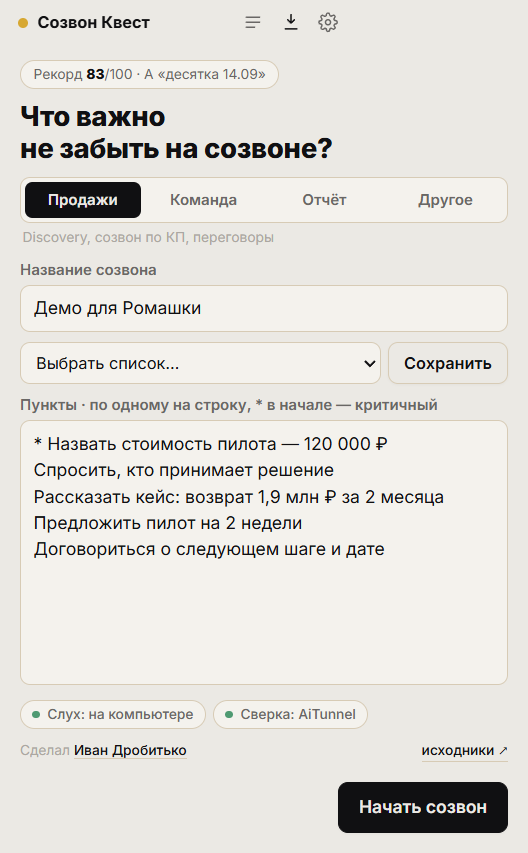
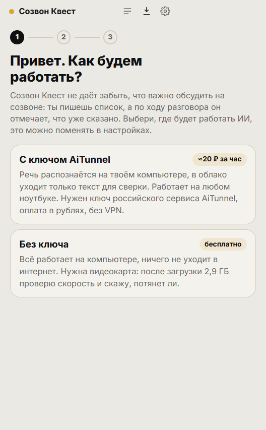
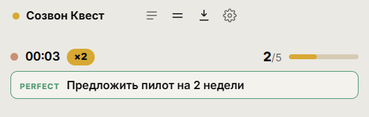

# Созвон Квест

Не даёт забыть, что важно обсудить на созвоне.

Перед звонком записываешь, что нужно спросить, сказать или о чём договориться. Во время разговора пункты отмечаются сами, как только ты их озвучил, и перед глазами всегда то, что ещё осталось. В конце балл из 100 и разбор: что узнал от собеседника, что упустил и в какой момент это стоило поднять.

Подходит для любого звонка, где есть список того, что нельзя пропустить: продажи, синк с командой, отчёт, собеседование. Работает поверх Телемоста, Zoom, Meet, Teams и любой другой программы, потому что слушает звук компьютера, а не конкретное приложение.

**[Скачать для Windows](https://github.com/glxaoc/sozvon-quest/releases/latest)** · бесплатно, открытый код, установка не нужна

<p align="center">
  
  
  
</p>

## Как начать

1. Скачай `SozvonQuest-x.y.z-portable.exe` со [страницы релиза](https://github.com/glxaoc/sozvon-quest/releases/latest) и запусти. Windows покажет предупреждение SmartScreen «неизвестный издатель»: «Подробнее» → «Выполнить в любом случае». Подписи кода нет, это личный проект.
2. Выбери режим в мастере первого запуска. Его можно поменять потом в настройках.
3. Выбери тип созвона и список пунктов: готовый, сохранённый или новый. Надень гарнитуру и нажми «Начать созвон».



**С ключом, рекомендуем.** Работает на любом ноутбуке. Речь распознаётся на компьютере, в облако уходит только текст для сверки. Час созвона стоит около 20 ₽. Нужен ключ [AiTunnel](https://aitunnel.ru): это российский агрегатор нейросетей, оплата в рублях, без VPN. Для старта хватит пополнения на 100–200 ₽. Мастер проверит ключ и скачает модель распознавания (144 МБ).

**Без ключа, бесплатно.** Всё работает на компьютере, в интернет ничего не уходит. Нужна видеокарта: мастер скачает модели (2,9 ГБ), замерит скорость и скажет, потянет ли компьютер. Если не потянет, предложит перейти на ключ.

Модели качаются один раз с зеркала в России, с докачкой после обрыва.

<br clear="right">

## Во время созвона

- **Пункт закрывается сам.** Когда ты его озвучил, карточка вспыхивает с оценкой PERFECT (сказано прямо) или GOOD (своими словами). Закрытия подряд дают серию ×2, ×3. Если приложение не уверено, карточка помечается «PARTIAL?», и её можно закрыть кликом.
- **Следующий пункт подсвечен.** Не надо искать глазами, что ещё осталось.
- **Критичные пункты.** Звёздочка в начале строки удваивает вес пункта, а если его пропустить, ранг выше A не поднимется.
- **Степаныч в углу.** Корги-ассистент радуется закрытиям и тихо подсказывает, если ты говоришь больше минуты подряд или пять минут ничего не закрывал.
- **Компактный режим.** Кнопка с двумя полосками сжимает окно до одной строки со следующим пунктом, чтобы оно не закрывало созвон. Окно держится поверх остальных, это переключается кнопкой в шапке.

<p align="center"></p>

## Типы созвонов

Продажи, Команда, Отчёт, Другое. У каждого типа свои готовые списки, ранги и норма доли речи: на отчёте нормально говорить 80 % времени, на продажах нет. Для продаж есть готовые списки для первого созвона и для созвона по КП. Свой список можно сохранить под именем и выбирать в один клик.

## Финал и балл

Балл из 100 докручивается с нуля, штампом влетает ранг. У каждого типа созвона свои ранги: в продажах от «Клиент вёл, ты кивал» до «Волк созвонов». Ниже реплика Степаныча про этот созвон, пропущенные пункты с минутой, когда их стоило поднять, и то, что ты узнал от собеседника.

| Блок | Вес | Что внутри |
|---|---|---|
| Покрытие пунктов | 65 | Perfect 1,0 · Good 0,8 · Partial 0,4 · пропуск 0. Критичный пункт весит вдвое |
| Собранная информация | 25 | По пунктам «спросить»: ответил ли собеседник по существу |
| Тайминг | 10 | Доля пунктов, закрытых до последних 20 % созвона |

Доля речи, самый длинный монолог, слова-паразиты и частота смены говорящих показываются справочно и в балл не входят.

Все созвоны сохраняются в Документы → SozvonQuest: `summary.md` с итогами и `session.json` с полной расшифровкой. Лучший результат виден на стартовом экране, история открывается кнопкой «Мои созвоны» в шапке.

## Важно знать

- **Гарнитура обязательна.** Без неё микрофон слышит динамики. Приложение отсеивает такое эхо, но с гарнитурой точнее.
- **Показывай окно, а не весь экран.** Если в созвоне демонстрируешь весь экран, собеседник увидит и эту панель.
- **Предупреждай собеседника**, что ведёшь запись и разбор разговора.
- **Ключ хранится только на твоём компьютере.** В логи не пишутся ни текст разговора, ни ключи.

## Если что-то не работает

В настройках есть «Сообщить о проблеме»: приложение копирует диагностику в буфер обмена и открывает форму на GitHub. Лог лежит в `%APPDATA%\SozvonQuest\logs`. Когда выходит новая версия, на стартовом экране появляется плашка со ссылкой.

Удалить приложение целиком: exe-файл, папка `%APPDATA%\SozvonQuest` (там же модели) и, если итоги созвонов не нужны, Документы → SozvonQuest.

## Для разработчиков

Electron, без бандлера. Микрофон захватывается через `getUserMedia`, звук собеседника через штатный механизм Electron `audio: 'loopback'` (WASAPI), оба канала идут в main-процесс как PCM 16 кГц.

- **Распознавание:** [T-one](https://github.com/voicekit-team/T-one) от Т-Банка через [sherpa-onnx](https://github.com/k2-fsa/sherpa-onnx), стриминг на процессоре.
- **Сверка:** через 0,4 с после твоей реплики модель получает открытые пункты и окно твоей речи за 30 секунд и отвечает, что закрыто, с цитатой и уверенностью. Порог автозакрытия 0,8. В режиме без ключа сверку делает Qwen3.5-4B через [node-llama-cpp](https://github.com/withcatai/node-llama-cpp) на видеокарте (Vulkan).
- **Финал:** один запрос на весь транскрипт, балл считается в `src/main/score.js`.

Замеры, сентябрь 2026:

| Что | Результат |
|---|---|
| Распознавание на компьютере | в 15–20 раз быстрее реального времени, расхождение с лучшим облачным распознавателем русского 20 % |
| От конца фразы до закрытия пункта | около 2,5 с в режиме с ключом |
| Сверка в облаке | 17 из 17 проверочных ситуаций в трёх прогонах подряд, 0,6–1,5 с на запрос |
| Сверка на компьютере, видеокарта | 13 из 17, 0,5–2 с |
| Сверка на компьютере, только процессор | от 16 с до 7 мин на запрос, для живого разговора не годится |

```bash
npm install
npm start            # запуск; ключ вводится в мастере или в .env (см. .env.example)
npm run start:mock   # без аудио: реплики печатаются руками
npm run test:llm     # регресс сверки, 17 ситуаций, нужен ключ
npm run build        # portable-exe в dist/
```

## Лицензии

Код — MIT. Модели распознавания и сверки скачиваются отдельно и распространяются под своими лицензиями: T-one (Т-Банк) и Qwen3.5 (Alibaba Cloud) — Apache-2.0.

Сделал [Иван Дробитько](https://t.me/ivandrobitko).
